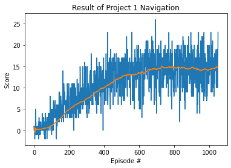

# project 1 : Navigation
This repo is for the deep reinforcement learning nanodegree of Udacity.
Espectially, in this repo, I will deal with the first project, Navigation.

**Note : The version of pytorch is 1.4.0. The original version from udacity is 0.4.0. Due to the version of numpy, I upgraded the version of pytorch.**

## **Prerequisites**
- OS: Ubuntu 20.04
- anaconda
- setup virtual environment using 'python' folder

## Dependencies
TODO: conda list

## The code structure of this project
- p1_navigation
  - 
  - cc

## How to start
This project is supposed that you have anaconda.

**0. clone this repository**
   ```bash
   mkdir project_1
   cd project_1
   git clone https://github.com/yesming/project_1_navigation.git
   ```
Now you can see the repository 'project_1_navigation'.

**1. activate virtual environment**
```bash
conda create --name drlnd python=3.6
source activate drlnd
```

**2. Environment setup and Execute**
```bash
cd p1_navigation/python
pip install .
```
you can see the file 'Navigation.ipynb'
Execute the file on the jupyter environment.


## Project
The goal is to collect as many yellow bananas as possible while avoiding blue bananas.

## State Space and Action space
The state space has 37 dimensions and contains the agent's velocity, alogn with ray-based perception of objects around the agent's forward direction.

And the discretized actions are described as below
```
0 : move forward
1 : move backward
2 : turn left
3 : turn right
```

## Reward and Evaluate
The agent gets +1 reward when the agent collects a yellow banana. However, a reward of -1 is provided for collecting a blue banana.

--------------------------

## Result
The agent was successfully learned the purpose(which is gathering yellow banana). At the end of learning, an average of reward is achieved about 15 points.

The learning video is ...


The result of learning is ...

