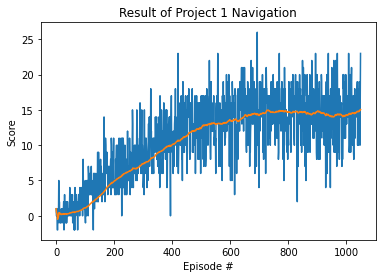

# Udacity - Deep Reinforcement Learning
## First Project - **Navigation**
---------------------
---------------------
# Table of Contents

- [Udacity - Deep Reinforcement Learning](#udacity---deep-reinforcement-learning)
  - [First Project - **Navigation**](#first-project---navigation)
- [Table of Contents](#table-of-contents)
  - [Environment](#environment)
  - [Purpose of Learning](#purpose-of-learning)
  - [State Space](#state-space)
  - [Action Space](#action-space)
  - [Learning Algorithm](#learning-algorithm)
  - [Result](#result)
  - [Future work](#future-work)

## Environment
In this environment, banana collector, if the agent gets a yellow banana, it gets a reward of +1, but if it steps on a blue banana, it gets a reward(penalty) of -1.
The Unity Environment is prepared at "./p1_navigation/Banana_Linux/Banana.x86_64".
You can use the environment through the below code.
```python
env = UnityEnvironment(file_name="./Banana_Linux/Banana.x86_64")
```
## Purpose of Learning
The purpose of this learning is to collect as many yellow bananas as possible.

## State Space
The state space has 37 dimensions and contains the agent's velocity, alogn with ray-based perception of objects around the agent's forward direction.

## Action Space
The discretized available actions are described as below
```
0 : move forward
1 : move backward
2 : turn left
3 : turn right
```

## Learning Algorithm
DQN(Deep Q-Networks) is adpoted to achieve the purpose of this project.
<br/>
The hyper-paramter is set as below.
```python
BUFFER_SIZE = int(1e5)  # replay buffer size
BATCH_SIZE = 64         # minibatch size
GAMMA = 0.99            # discount factor
TAU = 1e-3              # for soft update of target parameters
LR = 5e-4               # learning rate
UPDATE_EVERY = 4        # how often to update the network
```
Please check the comment.

<br/>

The model is implemented as below.
```python
# Linear layer
self.seed = torch.manual_seed(seed)
self.fc1 = nn.Linear(state_size, fc1_units)
self.fc2 = nn.Linear(fc1_units, fc2_units)
self.fc3 = nn.Linear(fc2_units, action_size)
```
The network is implemented as below.
- The input layer is 37 neurons which is equal to state_size.
- The first hidden layer of 64 neurons (fc1_units).
- The second hidden layer of 64 neurons (fc2_units).
<br/>
The Q-Network is implented in code as below.
```python
# Q-Network
self.qnetwork_local = QNetwork(
    state_size, action_size, seed).to(device)
self.qnetwork_target = QNetwork(
    state_size, action_size, seed).to(device)
self.optimizer = optim.Adam(self.qnetwork_local.parameters(), lr=LR)
```
where ***state_size=37***, ***action_size = 4***.  
<br/>


<br/>

## Result
The agent learned the strategy how to collect yellow bananas through over 1,000 episodes with random imput and memoery buffer.
According to the below fiture. The learning is sucess (The average score is over the 13.).



## Future work
Although the DQN algorithm is implemented in this project, there are various learning algorithms and techniques such as DQN, Dueling DQN, and Rainbow, etc. I will aim to implement them and compare their performance.
